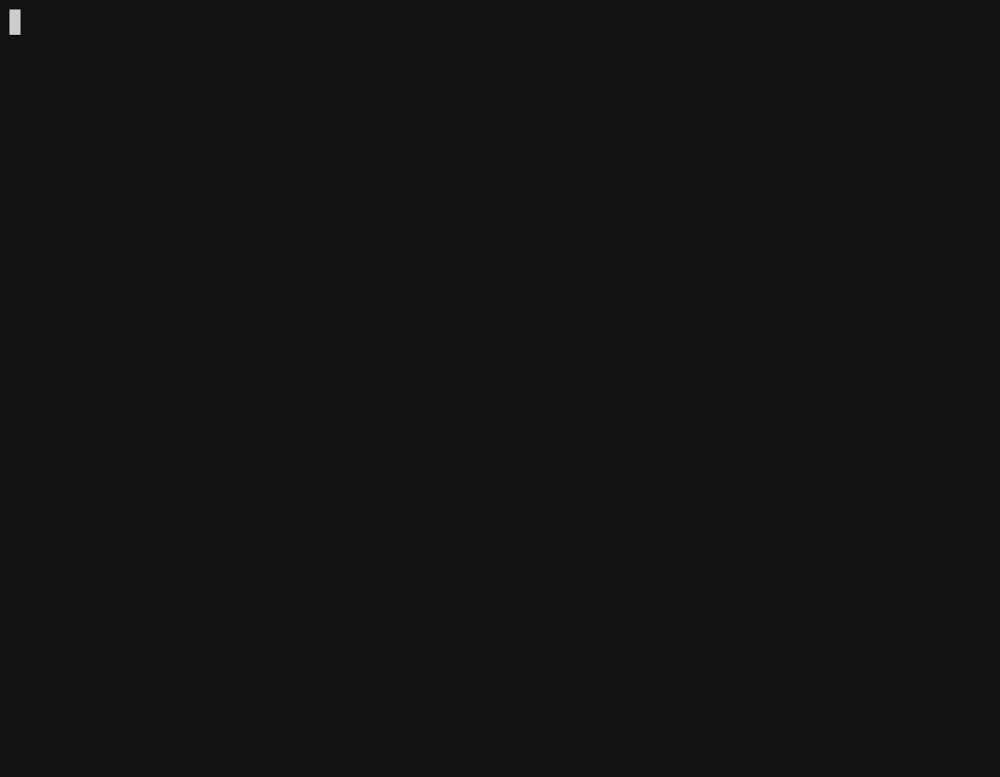

# nxpm

<p align="center"></p>

<p align="center">CLI to make the world-class <a href="https://github.com/nrwl/nx">nx workspace</a> even more amazing!</p>

<p align="center"><a href="https://nxpm.dev/">nxpm.dev</a></p>

[](https://oclif.io)
[](https://npmjs.org/package/nxpm)
[](https://circleci.com/gh/nxpm/nxpm/tree/master)
[](https://npmjs.org/package/nxpm)
[](https://github.com/nxpm/nxpm/blob/master/package.json)

<!-- toc -->
* [nxpm](#nxpm)
* [Usage](#usage)
* [Commands](#commands)
<!-- tocstop -->

### nxpm plugins

<p align="center"></p>

### nxpm projects

<p align="center"></p>

# Usage

<!-- usage -->
```sh-session
$ npm install -g nxpm
$ nxpm COMMAND
running command...
$ nxpm (-v|--version|version)
nxpm/1.9.2 darwin-x64 node-v12.16.2
$ nxpm --help [COMMAND]
USAGE
  $ nxpm COMMAND
...
```
<!-- usagestop -->

# Commands

<!-- commands -->
* [`nxpm config:get KEY`](#nxpm-configget-key)
* [`nxpm config:set KEY VALUE`](#nxpm-configset-key-value)
* [`nxpm help [COMMAND]`](#nxpm-help-command)
* [`nxpm plugins`](#nxpm-plugins)
* [`nxpm projects [PROJECTNAME] [TARGET]`](#nxpm-projects-projectname-target)
* [`nxpm registry:disable`](#nxpm-registrydisable)
* [`nxpm registry:enable`](#nxpm-registryenable)
* [`nxpm registry:start`](#nxpm-registrystart)
* [`nxpm registry:status`](#nxpm-registrystatus)
* [`nxpm release [VERSION]`](#nxpm-release-version)
* [`nxpm sandbox [SANDBOXID] [ACTION]`](#nxpm-sandbox-sandboxid-action)
* [`nxpm sandbox:pull`](#nxpm-sandboxpull)

## `nxpm config:get KEY`

describe the command here

```
USAGE
  $ nxpm config:get KEY

OPTIONS
  -g, --global  (required) Global config
  -h, --help    show CLI help
```

_See code: [src/commands/config/get.ts](https://github.com/nxpm/nxpm-cli/blob/v1.9.2/src/commands/config/get.ts)_

## `nxpm config:set KEY VALUE`

describe the command here

```
USAGE
  $ nxpm config:set KEY VALUE

OPTIONS
  -g, --global  (required) Global config
  -h, --help    show CLI help
```

_See code: [src/commands/config/set.ts](https://github.com/nxpm/nxpm-cli/blob/v1.9.2/src/commands/config/set.ts)_

## `nxpm help [COMMAND]`

display help for nxpm

```
USAGE
  $ nxpm help [COMMAND]

ARGUMENTS
  COMMAND  command to show help for

OPTIONS
  --all  see all commands in CLI
```

_See code: [@oclif/plugin-help](https://github.com/oclif/plugin-help/blob/v3.0.1/src/commands/help.ts)_

## `nxpm plugins`

Install and remove community plugins

```
USAGE
  $ nxpm plugins

OPTIONS
  -c, --cwd=cwd  [default: /Users/beeman/nxpm-cli] Current working directory
  -h, --help     show CLI help
  -r, --refresh  Refresh the list of plugins

ALIASES
  $ nxpm pl
```

_See code: [src/commands/plugins.ts](https://github.com/nxpm/nxpm-cli/blob/v1.9.2/src/commands/plugins.ts)_

## `nxpm projects [PROJECTNAME] [TARGET]`

Interactive menu to run builders and schematics for projects

```
USAGE
  $ nxpm projects [PROJECTNAME] [TARGET]

ARGUMENTS
  PROJECTNAME  The name of the project you want to operate on
  TARGET       The target to run (build, serve, test, etc)

OPTIONS
  -c, --cwd=cwd  [default: /Users/beeman/nxpm-cli] Current working directory
  -h, --help     show CLI help

ALIASES
  $ nxpm p
```

_See code: [src/commands/projects.ts](https://github.com/nxpm/nxpm-cli/blob/v1.9.2/src/commands/projects.ts)_

## `nxpm registry:disable`

Disable yarn and npm from using local npm registry

```
USAGE
  $ nxpm registry:disable
```

_See code: [src/commands/registry/disable.ts](https://github.com/nxpm/nxpm-cli/blob/v1.9.2/src/commands/registry/disable.ts)_

## `nxpm registry:enable`

Configure yarn and npm to use the local registry

```
USAGE
  $ nxpm registry:enable
```

_See code: [src/commands/registry/enable.ts](https://github.com/nxpm/nxpm-cli/blob/v1.9.2/src/commands/registry/enable.ts)_

## `nxpm registry:start`

Start local npm registry

```
USAGE
  $ nxpm registry:start
```

_See code: [src/commands/registry/start.ts](https://github.com/nxpm/nxpm-cli/blob/v1.9.2/src/commands/registry/start.ts)_

## `nxpm registry:status`

Show yarn and npm registry configuration

```
USAGE
  $ nxpm registry:status
```

_See code: [src/commands/registry/status.ts](https://github.com/nxpm/nxpm-cli/blob/v1.9.2/src/commands/registry/status.ts)_

## `nxpm release [VERSION]`

Release publishable packages in an Nx Workspace

```
USAGE
  $ nxpm release [VERSION]

ARGUMENTS
  VERSION  The version you want to release in semver format (eg: 1.2.3-beta.4)

OPTIONS
  -c, --cwd=cwd    [default: /Users/beeman/nxpm-cli] Current working directory
  -d, --dry-run    Dry run, don't make permanent changes
  -f, --fix        Automatically fix known issues
  -h, --help       show CLI help
  -i, --allow-ivy  Allow publishing Angular packages built for Ivy
  --ci             CI mode (fully automatic release)
```

_See code: [src/commands/release.ts](https://github.com/nxpm/nxpm-cli/blob/v1.9.2/src/commands/release.ts)_

## `nxpm sandbox [SANDBOXID] [ACTION]`

Create a sandbox using Docker

```
USAGE
  $ nxpm sandbox [SANDBOXID] [ACTION]

ARGUMENTS
  SANDBOXID  The ID of the sandbox
  ACTION     Action to perform on sandbox

OPTIONS
  -c, --cwd=cwd  [default: /Users/beeman/nxpm-cli] Current working directory
  -h, --help     show CLI help
  -r, --refresh  Refresh the list of plugins
```

_See code: [src/commands/sandbox.ts](https://github.com/nxpm/nxpm-cli/blob/v1.9.2/src/commands/sandbox.ts)_

## `nxpm sandbox:pull`

Pull images of sandboxes

```
USAGE
  $ nxpm sandbox:pull

OPTIONS
  -c, --cwd=cwd  [default: /Users/beeman/nxpm-cli] Current working directory
  -f, --force    Force removal of the sandboxes
  -h, --help     show CLI help
  -m, --remove   Remove all of the sandboxes before pulling
  -r, --refresh  Refresh the list of sandboxes
```

_See code: [src/commands/sandbox/pull.ts](https://github.com/nxpm/nxpm-cli/blob/v1.9.2/src/commands/sandbox/pull.ts)_
<!-- commandsstop -->
